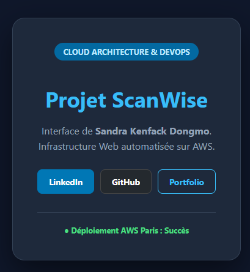

## 🏗️ Architecture Technique

```mermaid
graph TD
    User((Utilisateur)) -->|Port 80| IGW[Internet Gateway]
    subgraph VPC [AWS VPC - 10.0.0.0/16]
        subgraph Subnet [Public Subnet - 10.0.1.0/24]
            SG{Security Group}
            EC2[EC2 Instance: ScanWise Server]
            SG --> EC2
        end
        IGW --> SG
    end
    
    style EC2 fill:#f96,stroke:#333,stroke-width:2px
    style SG fill:#fff,stroke:#333,stroke-dasharray: 5 5
